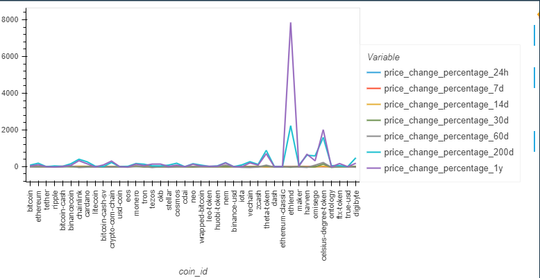
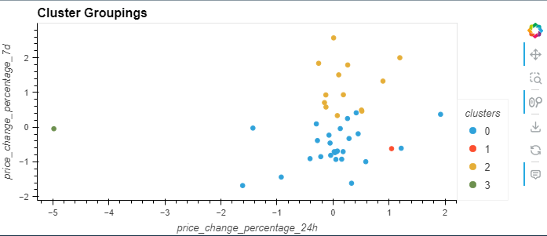
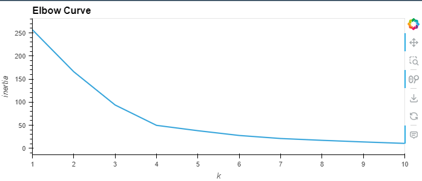

# Using Unsupervised Machine Learning to Cluster Cryptocurrency Prices

Contributor: Brian Kath

## Repository Structure

- Main Folder

  - .gitignore
  - Crypto_Clustering.ipynb
  - README.md

- Sub-folders

  - Resources
    - crypto_market_data.csv
  - Images
    - cluster_groupings.png
    - coin_id.png
    - elbow_curve.png

  

  <h4 style="text-align: center">Cryptocurrency Price Change Percentage</h4>
  

## Overview

For this project, I used Python, scikit-learn, and unsupervised machine learning to predict if cryptocurrencies are affected by 24-hour or 7-day price changes. I first imported a csv file containing price change percentages for 41 different cryptocurrencies across 24-hour, 7-day, 14-day, 30-day, and 60-day timeframes. I then used the K-means model to determine the optimal number of clusters to use for organizing the data. Next, I used Principal Component Analysis (PCA) to optimize the clusters. I also used PCA as another way of determining the optimal number of clusters to use with the data.  The best number of clusters using both K-means and PCA was four. Finally, I used HvPlot to create line and scatter plots to visualize both the optimal number of clusters and how the different clusters compare between the two models used.
